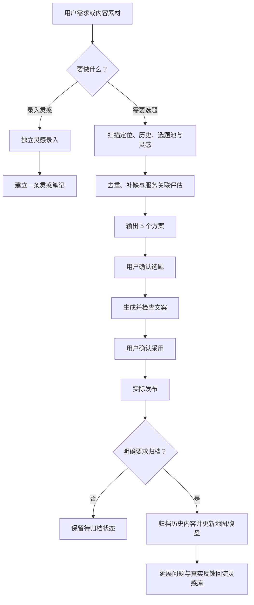

# 企业财税-老陈｜微信视频号内容生产库

用于管理面向成熟企业经营者的股权架构、公司治理、股权交易及相关财税合规内容：收集灵感、选择选题、撰写文案、确认发布、归档复盘。账号业务定位不因流程调整而改变。

## 模块入口

| 模块 | 作用 | 路径 |
| --- | --- | --- |
| 账号规则 | 定位、固定字段、维护和归档规范 | `内容库/00-首页与维护规则/` |
| 历史内容 | 已发布内容的唯一事实记录 | `内容库/01-历史内容/` |
| 内容地图与复盘 | 覆盖、去重和缺口判断 | `内容库/02-内容地图/`、`内容库/04-内容复盘/` |
| 选题规划 | 灵感库、成熟候选和业务选题池 | `内容库/03-选题规划/` |
| 流程模块 | 灵感、选题、文案、归档的可复用规则 | `.codex/skills/daily-video-account-planning/` |

## 主流程

灵感录入不自动进入选题或文案；确认文案不等于已发布；只有“实际发布 + 明确要求归档”同时满足才写入历史内容库。选题不依赖热点 API，也不按早中晚时段安排。

日常调用示例：

- “录入这段同行文案到灵感库。”
- “根据当前内容库给我 5 个合伙人退出选题。”
- “选择第 3 个，生成视频号文案。”
- “这条已发布，请按实际标题和正文归档。”
