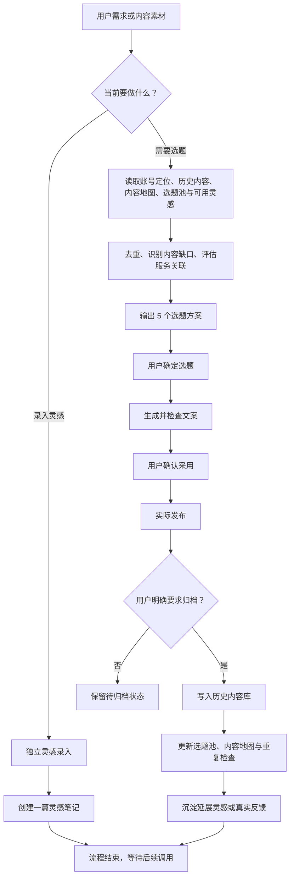
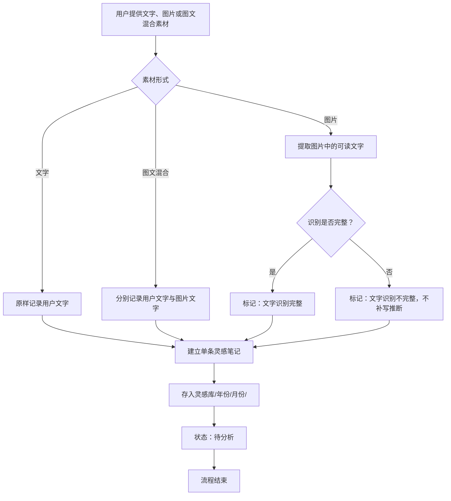
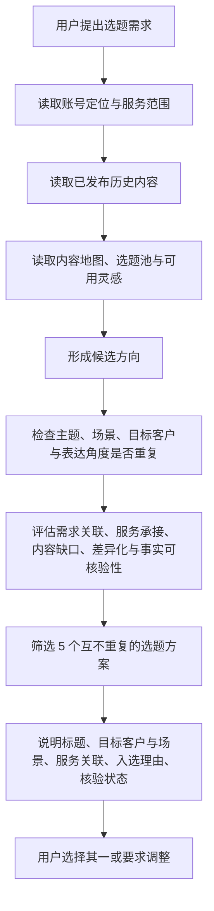
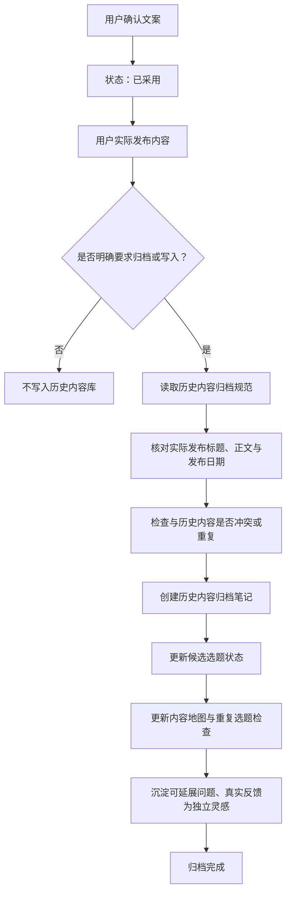

# 企业财税-老陈｜微信视频号内容生产库

## 项目维护规则

- [GitHub 同步提交规则](GitHub-同步提交规则.md)：用户明确要求同步、提交或 push 到 GitHub 时的唯一执行规则。

本仓库用于管理“企业财税-老陈”微信视频号的内容资产与生产流程：收集灵感、生成选题、撰写文案、确认发布、归档复盘。

内容围绕成熟企业的股权架构、公司治理、股权交易及相关财税合规服务展开，重点服务有股权设计、治理优化、交易安排与合规需求的企业经营者。账号业务定位不因流程调整而改变。

## 三层架构

| 层级 | 职责 | 位置 |
| --- | --- | --- |
| Agent | 判断用户任务、路由 Skill、控制阶段与写入边界 | `AGENTS.md`、`.codex/agents/video-account-operator.toml` |
| Skills | 分别执行灵感录入、选题规划、文案制作、发布归档 | `.codex/skills/` |
| Knowledge Base | 保存账号专属定位、规则、历史内容、选题、复盘与素材 | `内容库/` |

## 从哪里开始

根据当前需求选择一个入口：

- 要保存同行文案、图片文字或自己的想法：录入灵感。
- 要获得可选选题：发起选题需求。
- 已确认一个选题，要撰写视频文案：生成文案。
- 内容已实际发布，要留存正式记录：发布并归档。

## 仓库结构与模块路径

| 模块 | 用途 | 路径 |
| --- | --- | --- |
| 账号规则 | 账号定位、表达边界、固定选项与归档规范 | `内容库/00-首页与维护规则/` |
| 历史内容 | 已发布内容的事实记录，用于查重与覆盖判断 | `内容库/01-历史内容/` |
| 内容地图 | 按业务、客户、痛点和内容类型查看覆盖情况 | `内容库/02-内容地图/` |
| 选题规划 | 灵感库、候选选题与各业务方向选题池 | `内容库/03-选题规划/` |
| 内容复盘 | 重复选题检查、内容缺口与定位变化记录 | `内容库/04-内容复盘/` |
| 内容素材 | 标题、案例、风险场景、政策资料等写作素材 | `内容库/05-内容素材库/` |
| 项目 Agent | 判断当前阶段、路由 Skill 与控制资产写入边界 | `.codex/agents/video-account-operator.toml` |
| 灵感录入 | 独立保存原始文字、图片文字和反馈 | `.codex/skills/idea-intake/` |
| 选题规划 | 扫描历史库并提供候选选题 | `.codex/skills/topic-planning/` |
| 文案制作 | 为已确认主题制作合规视频号文案 | `.codex/skills/video-copywriting/` |
| 发布归档 | 为实际发布且明确要求归档的内容创建历史记录 | `.codex/skills/publish-archive/` |

项目规则与 Skill 路由由 [AGENTS.md](AGENTS.md) 管理；运营 Agent 依据用户当前动作调用对应模块：

| 场景 | 流程说明 |
| --- | --- |
| 录入灵感 | [idea-intake](.codex/skills/idea-intake/SKILL.md) |
| 获取选题 | [topic-planning](.codex/skills/topic-planning/SKILL.md) 与 [历史库读取规则](.codex/skills/topic-planning/references/history-vault-rules.md) |
| 撰写文案 | [video-copywriting](.codex/skills/video-copywriting/SKILL.md) |
| 发布归档 | [publish-archive](.codex/skills/publish-archive/SKILL.md) 与 [历史内容归档规范](内容库/00-首页与维护规则/历史内容归档规范.md) |

## 主流程

## 子流程：灵感录入

灵感录入是独立流程。完成录入后，不会自动进入选题、文案或归档。

### 灵感录入规则

- 一个灵感对应一篇独立笔记，存放在 `内容库/03-选题规划/灵感库/`。
- 同行文案可完整录入标题与正文。
- 图片仅提取可读文字，不保存、嵌入或链接图片。
- 图片文字不完整时，保留已识别内容并标记“文字识别不完整”，不补写推断。
- 用户未要求分析时，只完成录入；后续发起选题或分析时，才会读取相应灵感。

## 子流程：选题生成

每次选题由用户的当次需求触发，统一提供 5 个互不重复的方案。

候选方向主要来自以下内容：

1. 用户本次明确提出的主题或业务需求；
2. 灵感库中可用于分析的单条灵感；
3. 已发布内容可自然延展、但尚未覆盖的经营场景；
4. 各业务方向选题池中的成熟候选；
5. 内容地图识别出的客户痛点与主题缺口。

## 子流程：发布与归档

“确认文案”不等于“已发布”。只有内容实际发布且用户明确要求归档时，才创建正式历史记录。

历史内容归档格式以 [历史内容归档规范](内容库/00-首页与维护规则/历史内容归档规范.md) 为准；已发布内容库是内容查重与覆盖判断的事实依据。

## 日常使用示例

- “录入这段同行文案到灵感库。”
- “根据当前内容库给我 5 个合伙人退出选题。”
- “选择第 3 个，生成视频号文案。”
- “这条已发布，请按实际标题和正文归档。”

## 内容使用边界

- 内容需服务账号定位，并落到真实企业经营场景。
- 政策、税率、期限、处罚、平台规则与办理流程等确定性信息，需以当前官方来源核验。
- 不虚构政策、案例、数据或处罚结果。
- 不承诺结果，不提供规避监管的表达。
